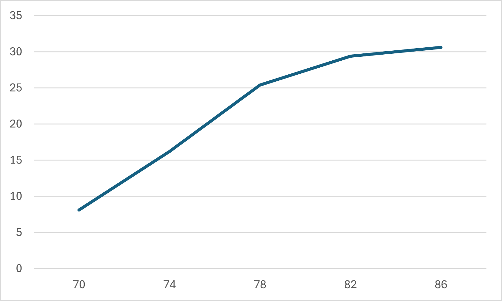

# Комп'ютерні системи імітаційного моделювання

# СПм-24-2, Черняк Максим Анатолійович

## Лабораторна робота №1. Опис імітаційних моделей та проведення обчислювальних експериментів

### Мета роботи: 
Ознайомитись з готовими моделями з різних предметних областей реального світу, які пропонуються середовищем мультиагентного імітаційного моделювання NetLogo. Навчитися описувати модель та проводити обчислювальні експерименти для дослідження її роботи.

### Вербальний опис моделі:
Симуляція поширення пожежі в лісі. Ліс складається з дерев, кожне з яких моделюється клітинкою на сітці. Вогонь починається з лівого краю лісу та поширюється на сусідні дерева у чотирьох напрямках: на північ, південь, схід і захід. Крім цього є вплив вітру: він збільшує ймовірність займання дерев у напрямку його руху та зменшує - у протилежному напрямку. Модель демонструє, що поширення вогню залежить від щільності дерев та умов довкілля, зокрема напрямку та сили вітру.

### Керуючі параметри:
- density (щільність насаджень) - визначає відсоток площі, зайнятої деревами;
- probability-of-spread (ймовірність розповсюдження) - визначає шанс того, що полум’я перейде від палаючого дерева до сусіднього;
- south-wind-speed (швидкість південного вітру) - встановлює силу вітру, який дує з півдня; може бути від’ємним для створення північного вітру;
- west-wind-speed (швидкість західного вітру) - встановлює силу вітру, який дує із заходу; може бути від’ємним для створення східного вітру.

### Внутрішні параметри:
- стан клітинки - кожне дерево може бути зеленим (не палає), бурим (палає) або чорним (відсутнє);
- множина клітинок, що горять на поточному кроці моделювання;

### Показники роботи системи:
- percent burned (відсоток вигорання) - кількість клітинок, які повністю згоріли після завершення симуляції.

### Хід виконання
Перейдемо на NetLogo та оберемо імітаційну модель  [Fire Simple Extension 2](https://www.netlogoweb.org/launch#https://www.netlogoweb.org/assets/modelslib/IABM%20Textbook/chapter%203/Fire%20Extensions/Fire%20Simple%20Extension%202.nlogox). Вона є простою моделлю поширення вогню у лісі, з урахуванням щільності дерев та напрямку вітру.

Кількість тіків постійна: 100

#### 1 Перший експеримент проведемо із заданням постійних параметрів: 
- щільність: 80%;
- швидкість південного вітру: 9 м/c;
- швидкість західного вітру: 6 м/c;

Змінним значенням буде вірогідність розповсюдження вогню на сусідні дерева.

|Розповсюдження (вір.), % | Вигорання,% |
|-------------|---------------|
| 60 | 5.2 |
| 65 | 12.9 |
| 70 | 21.6 |
| 75 | 26.7 |
| 80 | 30.2 |

Побудуємо графік залежності

І як видно із наведеного графіку чим вища ймовірність розповсюдження, тим інтенсивніше відбувається вигорання.

#### 2 Для другого екперименту оберемо інші постійні параметри: 
- щільність: 80%;
- вірогідність розповсюдження: 75%; 
- швидкість західного вітру: 6 м/c;

Змінним значенням в цей раз буде швидкість південного вітру.

|Швидкість південного вітру, м/c | Вигорання,% |
|-------------|---------------|
| 0 | 25.9 |
| 2 | 26.5 |
| 4 | 27.1 |
| 6 | 26.3 |
| 8 | 28.2 |

Побудуємо графік залежності

Як бачимо відсток вигорання збільшується при збільшенні швидкості вітру, але не так суттєво як при першому екперименті. Різниця між відсутністю південного вітру та його швидкості 8 м/c 2.3%.

#### 3 Для третього екперименту оберемо інші постійні параметри: 
- вірогідність розповсюдження: 75%; 
- швидкість західного вітру: 6 м/c;
- швидкість південного вітру: 9 м/c;

Змінним значенням в цей раз буде щільність насаджень.
|Щільність насаджень, % | Вигорання,% |
|-------------|---------------|
| 70 | 8.1 |
| 74 | 16.2 |
| 78 | 25.4 |
| 82 | 29.4 |
| 86 | 30.6 |

Побудуємо графік залежності

Так само як і в попередніх екпериментах відсоток вигорання збільшується при збільшенні щільності насадженнь. Але як бачимо при досягенні певного значення цей ріст зменшується.