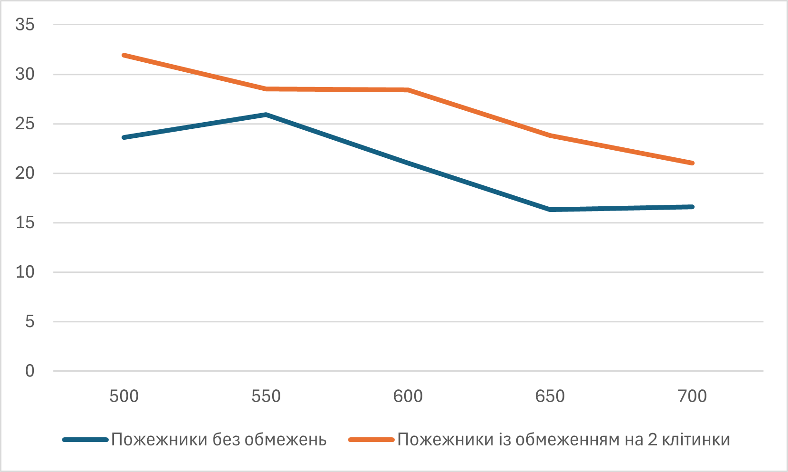

# Комп'ютерні системи імітаційного моделювання

# СПм-24-2, Черняк Максим Анатолійович

## Лабораторна робота №2. Редагування імітаційних моделей у середовищі NetLogo

### Варіант 5

### Мета роботи: 
Отримати уявлення про синтаксис та можливості мови мультиагентного імітаційного моделювання NetLogo.
Навчитися вносити зміни до вихідного коду готових моделей з різних предметних областей, які пропонуються середовищем NetLogo.

### Хід виконання

Кількість тіків постійна: 200

#### 1. Зміна моделі згідно завдання
Додамо до нашої моделі пожежних які гаситимуть пожежу, відповідно це приведе до зміни з червоного на чорний [LB2.1](lb2_1.nlogox).

#### 2. Зміна логіки моделі на власний розсуд
Далі внесемо зміни до моделі зробивши, щоб у пожежників була обмежена кількість води [LB2.2](lb2_2.nlogox).

#### 3. Проведемо обчислювальний експеримент
Поглянемо, як зміниться площа вигорання в залежності від кількості пожежників та обмеження клітинок, які може загасити кожен із них.

Проведемо 5 експеримнентів коли пожежники можуть гасити безмежну кількість клітинок та коли тільки дві. Отримані дані зведемо до таблиці.

| Кіл. пожежників |Без обмежень | З обмеженням (2) |
|-------------|---------------|--------|
| 500 | 23,6 | 31.9 |
| 550 | 25.9 | 28.5 |
| 600 | 21 | 28.4 |
| 650 | 16.3 | 23.8 |
| 700 | 16.6 | 21 |

Далі побудуємо графік 

Як бачимо із отриманого графіку, то обмеження можливості гасіння пожежників приводить до збільшення площі вигорання, навіть якщо збільшувати кількість самих пожежників.