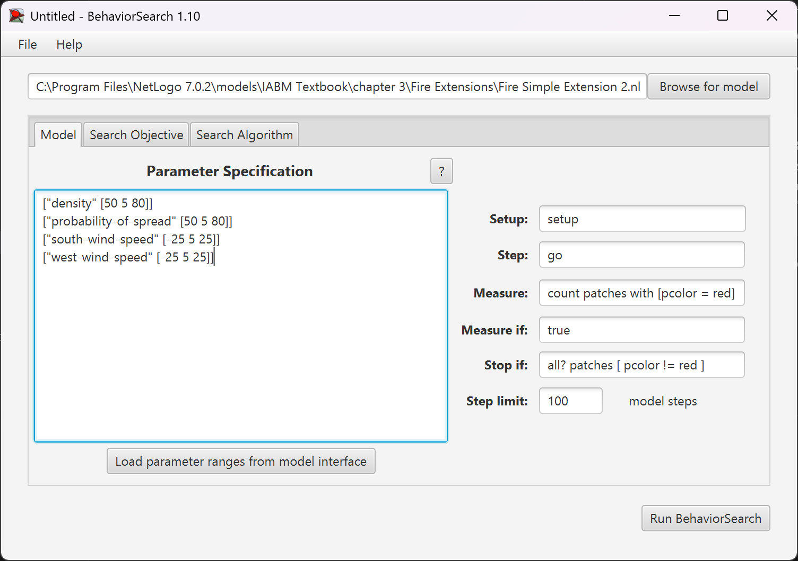
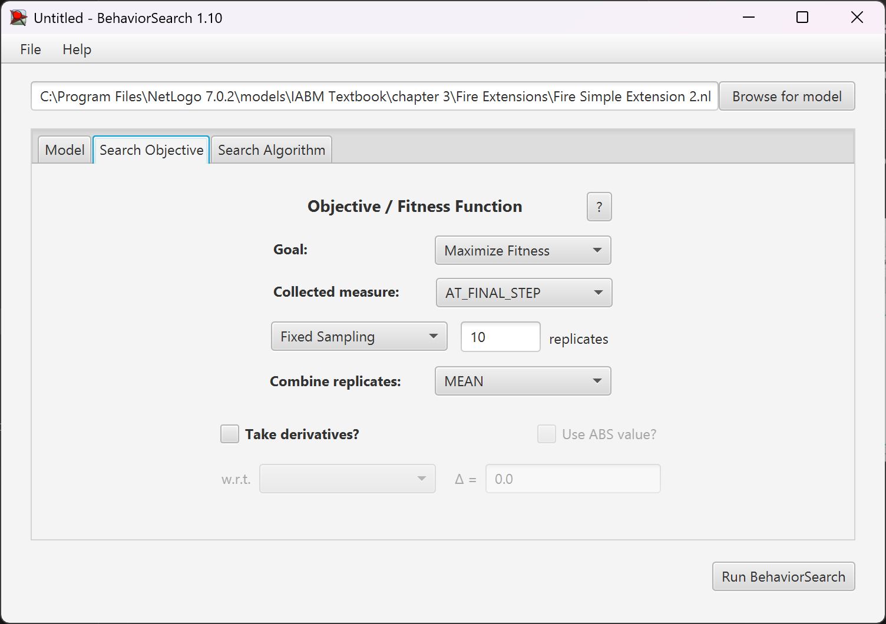
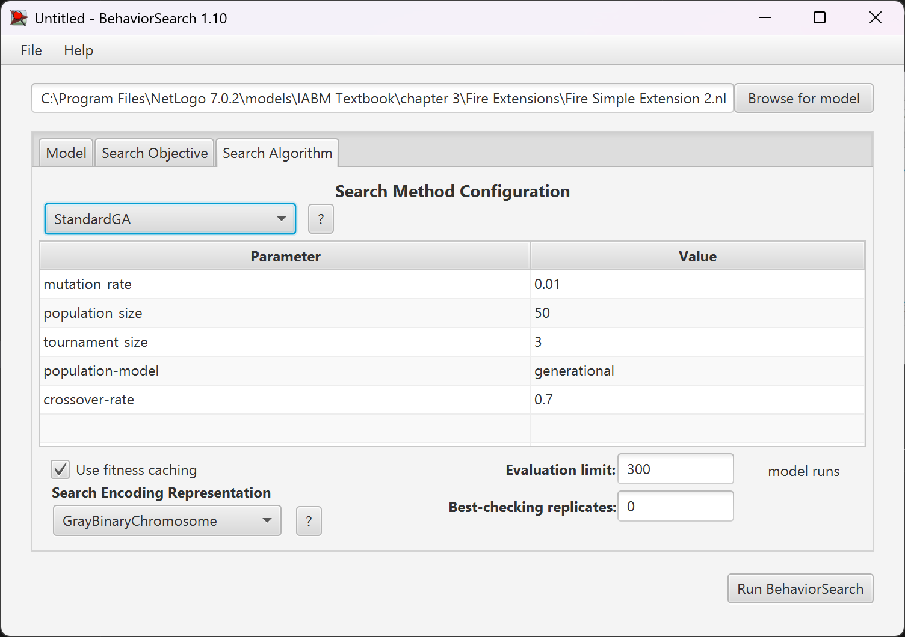
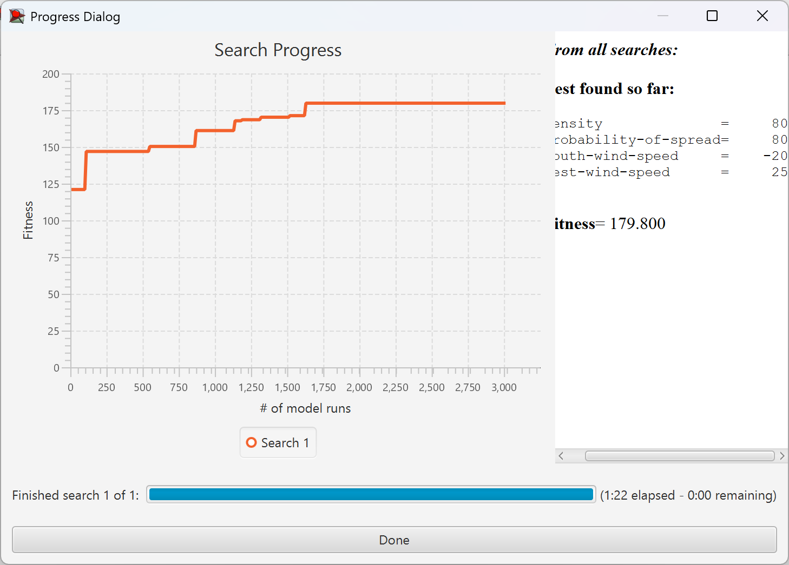
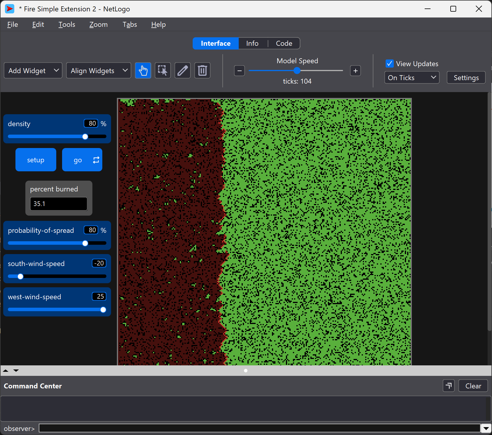
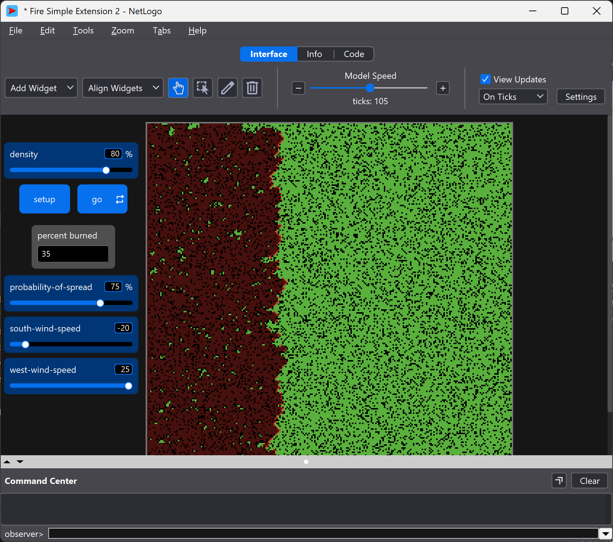

# Комп'ютерні системи імітаційного моделювання

# СПм-24-2, Черняк Максим Анатолійович

## Лабораторна робота №3. Використання засобів обчислювального интелекту для оптимізації імітаційних моделей

### Варіант 5

### Мета роботи: 
Дослідити застосування генетичних алгоритмів та випадкового пошуку для налаштування параметрів імітаційних моделей, використовуючи середовище BehaviorSearch.

### Хід виконання
Спочатку взначемо керуючі параметри та показники роботи моделі.

### Керуючі параметри:
- density (щільність насаджень) - визначає відсоток площі, зайнятої деревами;
- probability-of-spread (ймовірність розповсюдження) - визначає шанс того, що полум’я перейде від палаючого дерева до сусіднього;
- south-wind-speed (швидкість південного вітру) - встановлює силу вітру, який дує з півдня; може бути від’ємним для створення північного вітру;
- west-wind-speed (швидкість західного вітру) - встановлює силу вітру, який дує із заходу; може бути від’ємним для створення східного вітру.

### Показники роботи системи:
- percent burned (відсоток вигорання) - кількість клітинок, які повністю згоріли після завершення симуляції.

Завантажимо діапазони параметрів із інтерфейсу моделі

```
["density" [50 5 80]]
["probability-of-spread" [50 5 80]]
["south-wind-speed" [-25 5 25]]
["west-wind-speed" [-25 5 25]]
```

Зробимо максимізацію. Для початку виставимо дані параметри 



Будемо вимірювати кількість спалених клітинок.

Далі виставимо налаштування цільової функції



Спершу налаштуємо алгоритм пошуку для простого генетичного алгоритму



Запустимо пошук параметрів імітаційної моделі, використовуючи генетичний алгоритм



Зробимо такий самий пошук параметрів імітаційної моделі, використовуючи випадковий пошук


І як бачимо із отриманого результату, то найоптимальніші параметри майже збігаються для обох випадкового пошуку та генетичного алгоритму

І якщо ми запустимо модель із даними параметрами, то як можна помітити, то різниця у відсотках зрорівших дерев не така вже і велика

Генетичний алгоритм


Випадковий пошук
