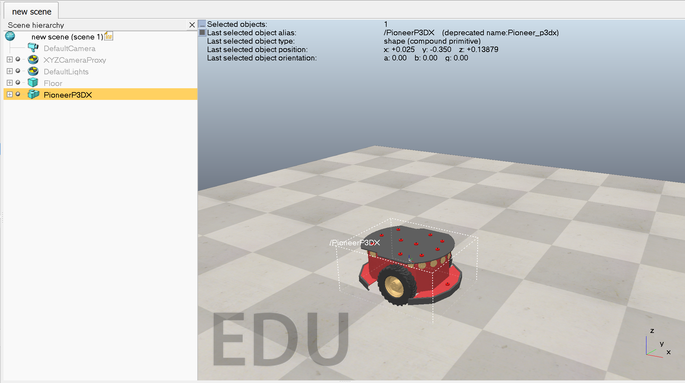
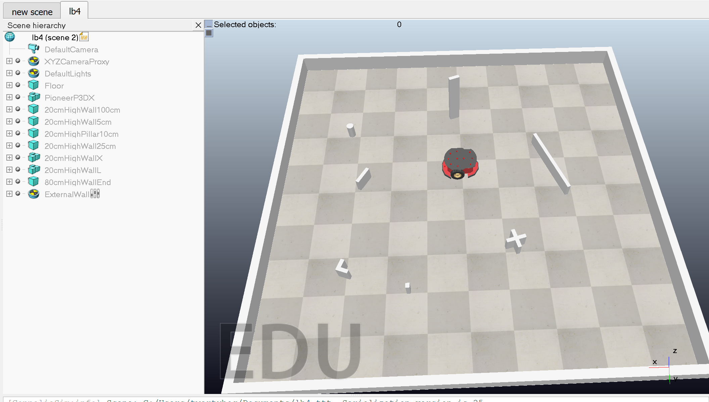
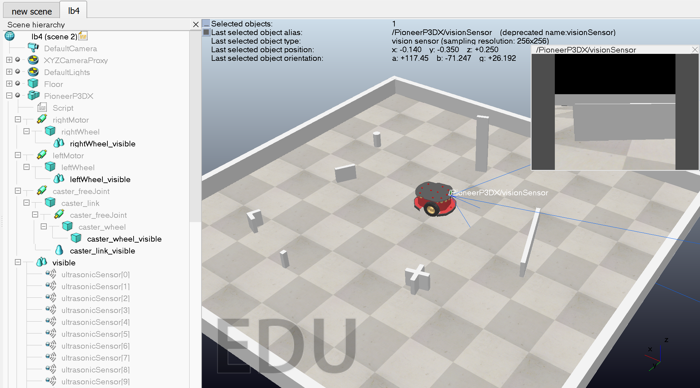
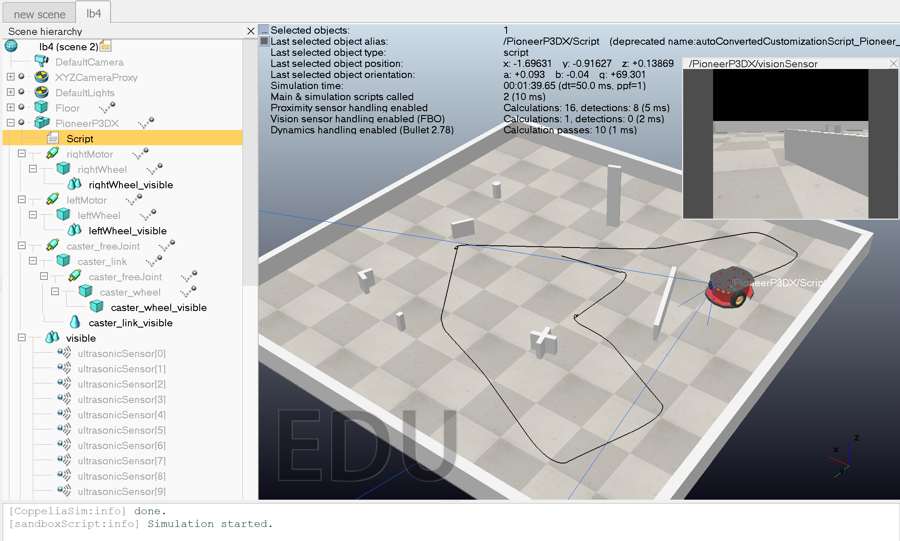
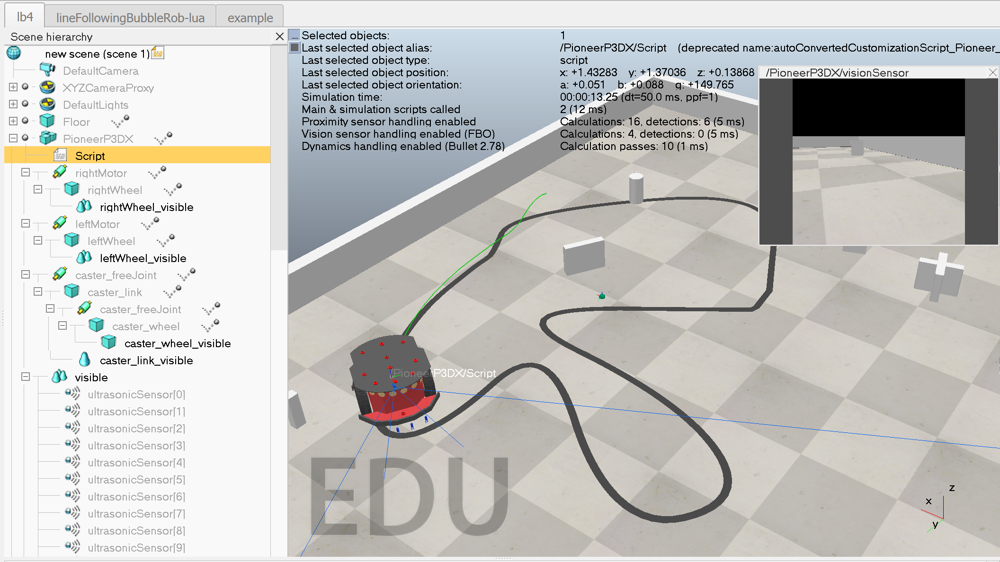

# Комп'ютерні системи імітаційного моделювання

# СПм-24-2, Черняк Максим Анатолійович

## Лабораторна робота №4. Моделювання у середовищі CoppeliaSim

### Мета роботи: 
Ознайомитись із можливостями середовища робототехнічного моделювання CoppeliaSim. Використовувати існуючі моделі та компоненти, отримати навички корегування логіки їхньої роботи. Отримати уявлення про синтакс мови Lua.

### Хід виконання

Додамо робота Pioneer P3DX

До сцени додамо декілька об'єктів, які слугуватимуть як перепони

Далі додамо на робота камеру 

Змінимо скрипт додавши можливість малювання пройденого шляху робота

Додамо ще 3 ссенсори для відслідковування створеного шляху та модифікуємо скрипт для його коректної роботи 

Як бачимо із рисунка вище, то він уміє їздити за шляхом, хоча у нього присутні проблеми із різкими поворотами
